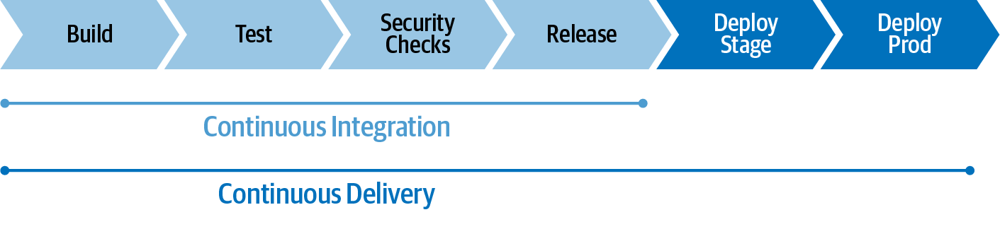
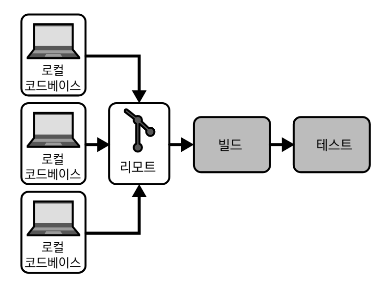

# healthy_meal_infra
캡스톤 프로젝트 백엔드 인프라 코드

### 개념

- **DevOps**: 지위나 배경에 관계 없이 사람들이 시스템을 구상, 개발, 배포 및 운영하기 위해 함께 협력하는 문화
    - 분리된 부서간의 업무 떠넘기기 대신 코드, 배포 프로세스의 소유권 공유
    - 사일로화된 부서에서 다기능 팀으로의 전환
- **GitOps**: Git 저장소를 단일 소스로 사용하여 인프라를 코드로 제공하는 방법론 및 관행
    - DevOps를 개선하고 구현하는 구체적인 방법
    - 중요 원칙
        1. Git을 신뢰할 수 있는 단일 소스로 취급
        2. 모든 것은 코드로 표현
        3. 작업은 Git 워크플로를 통해 수행

- **CI (Continuous Integration)**: 머지하고 확인해야 할 코드 양을 최소화
    - 변경 사항을 가능한 한 자주 추가
    - 자동 파이프라인을 통해 결함을 쉽게 발견

- **CD (Continuous Delivery)**: 언제, 어떤 환경에서라도 자동으로 코드 배포가 가능해야 함
    - 코드 베이스를 항상 배포 가능한 상태로 유지
    - 자동 파이프라인을 활용하여 언제든지 프로덕션에 배포할 수 있음
    

- **클라우드 네이티브**: 클라우드 기술의 활용을 목표로 애플리케이션을 개발하기 위한 접근 방식
    - 플랫폼: 클라우드 네이티브 애플리케이션은 클라우드 같은 동적 분산 환경을 기반으로 하는 플랫폼에서 실행
    - 속성: 클라우드 네이티브 애플리케이션은 확장 가능하고 느슨하게 결합되며 복원력이 뛰어나고 관리가 용이하며 관찰 가능하도록 설계
    - 실행: 견고한 자동화를 통해 빈번하고 예측 가능한 방식으로 시스템을 변경
